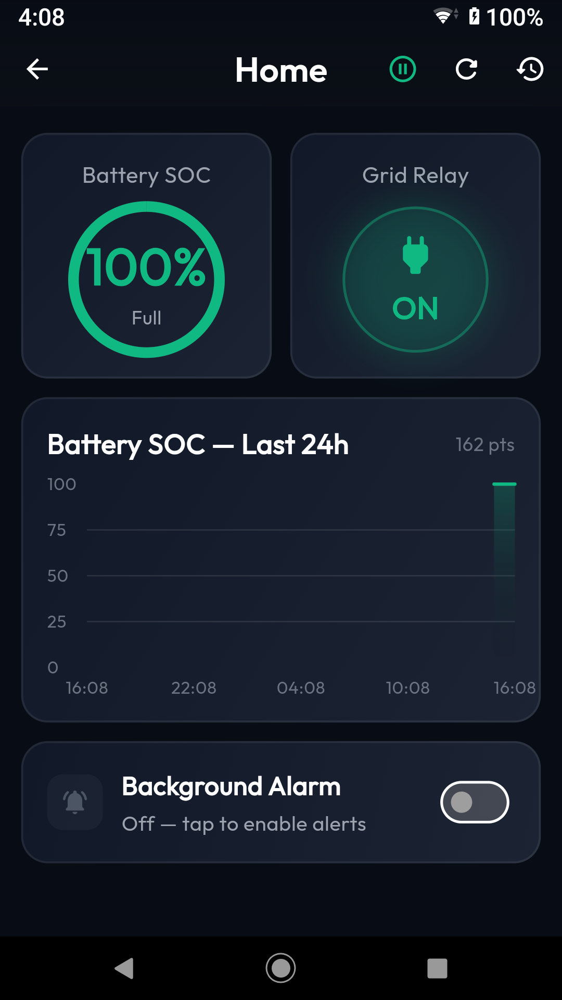
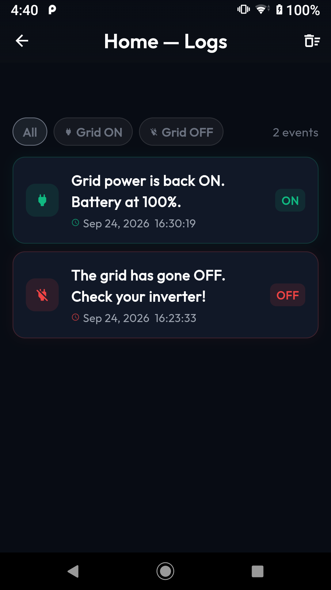

# Solar Inverter Monitor

Solar Inverter Monitor is an Android app for monitoring a solar inverter through its Solarman-compatible data logger. It shows battery state of charge (SOC), grid relay status, a 24-hour SOC chart, and a history of grid outages and restorations. Optional alerts continue monitoring while the app is in the background.

**Tested setup:** Deye SUN-5K-SG03LP1-EU hybrid inverter with a Solarman LSW-3 Wi-Fi data logger. The register addresses used by the app come from the [deye_solarman](https://github.com/Mhmdkh77/deye-solarman) Dart library. Other inverter models may use different register layouts.

The app reads inverter data over the local network. It does not need a Solarman account and does not change inverter settings.

## Screenshots

 

## What you can do

- Add a data logger by scanning the local network or entering its IP address and serial number.
- Save multiple loggers and open a dashboard for each one.
- See battery SOC and whether the inverter reports the grid relay as on or off.
- View the last 24 hours of SOC readings and filter the grid event log.
- Enable or disable grid-change alerts separately for each logger.
- Clear a logger's event log, clear all history, or remove a logger and its stored data.

## How the connection works

The phone connects to the **data logger**, which relays Modbus requests to the inverter. Solar Inverter Monitor uses `deye_solarman`, pinned to `v1.0.2` in [pubspec.yaml](pubspec.yaml), for SolarmanV5 communication.

| Method | What you need |
| --- | --- |
| Scan | Phone and logger on the same local broadcast network. The app discovers the logger's IP address and serial number. |
| Add manually | A reachable logger IP address and its serial number, found on the logger's label. The default TCP port is `8899` and can be changed in the form. |

The LSW-3 can join a home Wi-Fi network or provide its own Wi-Fi access point. On home Wi-Fi, the router assigns its IP address. On the logger's access point, connect your phone to that network and enter the logger's reachable address manually. Scanning uses UDP broadcast; a known address can be connected to directly.

The dashboard requests holding registers `184` through `194` and uses Battery SOC (`184`) and Grid Relay Status (`194`). The app does not display every value available in the library.

## Run the app

You need the [Flutter SDK](https://docs.flutter.dev/get-started/install), an Android device, and a reachable data logger for live readings. This repository targets Dart `>=3.2.2 <4.0.0`. An emulator can show the UI, but it needs network access to the logger for live data.

```sh
flutter pub get
flutter run
```

In the app:

1. Tap **Add Logger** and choose **Scan Network** or **Add Manually**.
2. Give the logger a name and confirm its IP address, serial number, and port.
3. Open the logger to view its dashboard.
4. Enable **Background Alarm** if you want alerts for grid state changes. Grant notification permission when Android asks.

If discovery finds nothing, check that the phone can reach the logger on the current Wi-Fi network. You can still add a known address manually.

## Monitoring and local data

While a dashboard is open, the app polls about every 10 seconds. When alerts are enabled, an Android foreground service polls enabled loggers about every 30 seconds and shows a persistent monitoring notification. Polls can take longer when several loggers are configured or a logger does not respond.

The first valid grid reading establishes the starting state. A later change records a grid-off or grid-on event and, when alerts are enabled, shows an alarm notification. Incomplete or invalid readings are discarded rather than interpreted as an outage. Android notification and full-screen permissions, device settings, and background restrictions affect how prominently an alert appears.

Logger configuration is saved with SharedPreferences. SOC samples and grid events are stored locally in SQLite. The chart shows the last 24 hours; SOC samples older than seven days are removed as new samples arrive. Event logs remain until you clear them or remove the logger.

## Project layout

```text
lib/
  main.dart                         App startup and theme
  models/                           Logger configuration and reading validation
  providers/data_loggers_provider.dart
  services/
    background_service.dart         Foreground service and notifications
    db_helper.dart                   SQLite history and grid transitions
  ui/                                Home, dashboard, logs, settings, splash
android/                             Android app and permissions
test/                                Reading validation tests
```

## Development status

```sh
flutter analyze
flutter test
```

The app is currently configured for **Android**. The `web/` folder is Flutter-generated scaffolding; the web app is not tested or supported. Release builds currently use Android's debug signing configuration, so configure release signing before distributing an APK.

## License

MIT. See [LICENSE](LICENSE).
