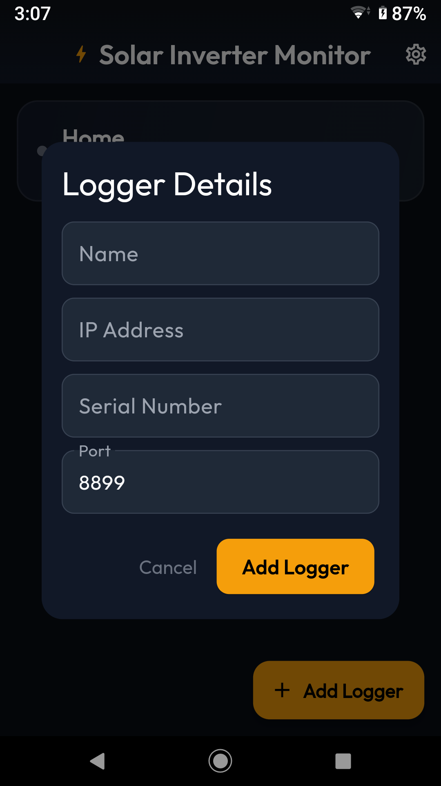
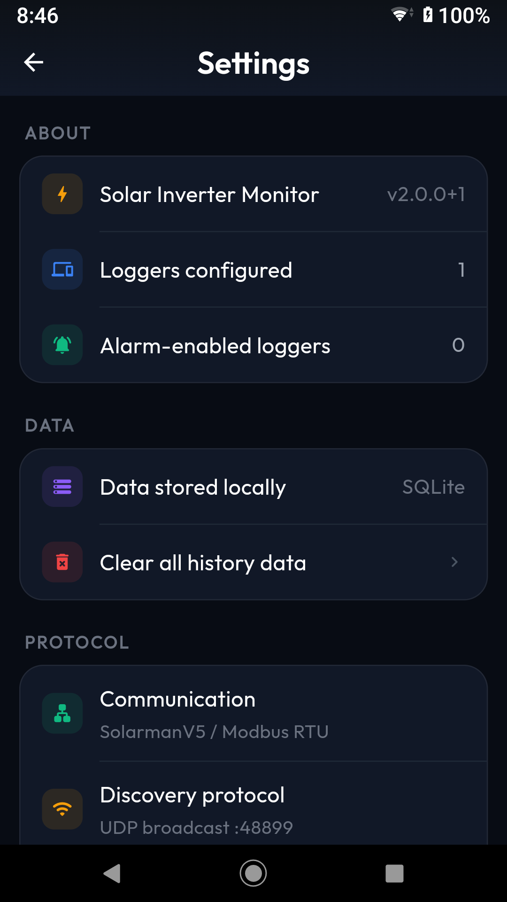

# Solar Inverter Monitor

Solar Inverter Monitor is an Android app for detecting grid outages and restorations through a Solarman-compatible data logger. Its dashboard shows live battery state of charge (SOC), grid relay status, battery charging or discharging power, and PV1 + PV2 power. It also keeps a log of grid changes. When you enable Background Alarm, the app keeps checking the grid status and alerts you to changes even when the dashboard is closed.

**Tested setup:** Deye SUN-5K-SG03LP1-EU hybrid inverter with a Solarman LSW-3 Wi-Fi data logger. The register addresses used by the app come from the [deye_solarman](https://github.com/Mhmdkh77/deye-solarman) Dart library. Other inverter models may use different register layouts.

The app reads inverter data over the local network. It does not need a Solarman account and does not change inverter settings.

## Screenshots

| Live dashboard | Grid event log |
| :---: | :---: |
|  |  |
| Add a logger manually | Settings |
|  |  |

## What you can do

- Add a data logger by scanning the local network or entering its IP address and serial number.
- Save multiple loggers and open a dashboard for each one.
- See battery SOC, grid relay status, battery charging or discharging power, and PV1 + PV2 power while the dashboard is open.
- Filter the grid event log by outage or restoration.
- Enable or disable grid-change alerts separately for each logger.
- Clear a logger's event log, clear all history, or remove a logger and its stored data.

## How the connection works

The phone connects to the **data logger**, which relays Modbus requests to the inverter. Solar Inverter Monitor uses the [deye_solarman Dart library](https://github.com/Mhmdkh77/deye-solarman) for SolarmanV5 communication. It is a Git dependency pinned to `v1.0.2` in [pubspec.yaml](pubspec.yaml); `flutter pub get` downloads it automatically.

| Method | What you need |
| --- | --- |
| Scan | Phone and logger on the same local broadcast network. The app discovers the logger's IP address and serial number. |
| Add manually | The serial number printed on the logger's label, plus a reachable IP address. When the logger is on home Wi-Fi, find its IP address in the router's device list. The default TCP port is `8899` and can be changed in the form. |

The LSW-3 can join a home Wi-Fi network or provide its own Wi-Fi access point. On home Wi-Fi, the router assigns its IP address. On the logger's access point, connect your phone to that network and enter the logger's reachable address manually. Scanning uses UDP broadcast; a known address can be connected to directly.

The dashboard requests holding registers `184` through `194` and displays Battery SOC (`184`), PV1 and PV2 power (`186`, `187`), Battery Power (`190`), and Grid Relay Status (`194`). On the tested inverter, positive battery power means discharging. The PV figure is the sum of PV1 and PV2; the app does not display every value available in the library.

## Run the app

You need the [Flutter SDK](https://docs.flutter.dev/get-started/install), an Android device, and a reachable data logger for live readings. This repository targets Dart `>=3.2.2 <4.0.0`. An emulator can show the UI, but it needs network access to the logger for live data.

```sh
flutter pub get
flutter run
```

In the app:

1. Tap **Add Logger** and choose **Scan Network** or **Add Manually**.
2. Give the logger a name and confirm its IP address, serial number, and port.
3. Open the logger to view its dashboard.
4. Enable **Background Alarm** if you want alerts for grid state changes. Grant notification permission when Android asks.

If discovery finds nothing, check that the phone can reach the logger on the current Wi-Fi network. You can still add a known address manually.

## Monitoring and local data

While a dashboard is open, it refreshes about every 10 seconds. The pause button stops only these dashboard updates; the refresh button fetches one reading immediately. When Background Alarm is enabled, an Android foreground service checks the enabled logger's grid status about every 30 seconds and shows a persistent notification. Dashboard pause does not stop these background grid checks. Polls can take longer when several loggers are configured or a logger does not respond.

The first valid grid reading establishes the starting state. A later change records a grid-off or grid-on event and, when alerts are enabled, shows an alarm notification. Incomplete or invalid readings are discarded rather than interpreted as an outage. Android notification and full-screen permissions, device settings, and background restrictions affect how prominently an alert appears.

Logger configuration is saved with SharedPreferences. Grid changes are stored locally in SQLite and remain until you clear the event log or remove the logger.

## Project layout

```text
lib/
  main.dart
  models/
    data_logger.dart
    inverter_reading.dart
  providers/
    data_loggers_provider.dart
  services/
    background_service.dart
    db_helper.dart
  ui/
    dashboard_screen.dart
    event_logs_screen.dart
    home_screen.dart
    settings_screen.dart
    splash_screen.dart
android/
screenshots/
test/
  inverter_reading_test.dart
tool/
  generate_icons.py
pubspec.yaml
LICENSE
```

`lib/` contains the app, `android/` contains its Android configuration, `screenshots/` holds the README images, and `tool/` contains the launcher icon generator.

## Development status

```sh
flutter analyze
flutter test
```

The app supports **Android**. To build a release APK, create your own private Android signing key and `android/key.properties` as described in the [Flutter Android release guide](https://docs.flutter.dev/deployment/android#sign-the-app), then run `flutter build apk --release`. Signing credentials are excluded from Git.

The launcher artwork is defined in [tool/generate_icons.py](tool/generate_icons.py). To edit and regenerate the Android icon sizes, install Python and Pillow, then run:

```sh
python -m pip install Pillow
python tool/generate_icons.py
```

Python is only needed to regenerate the icons, not to build or run the app.

## License

MIT. See [LICENSE](LICENSE).
